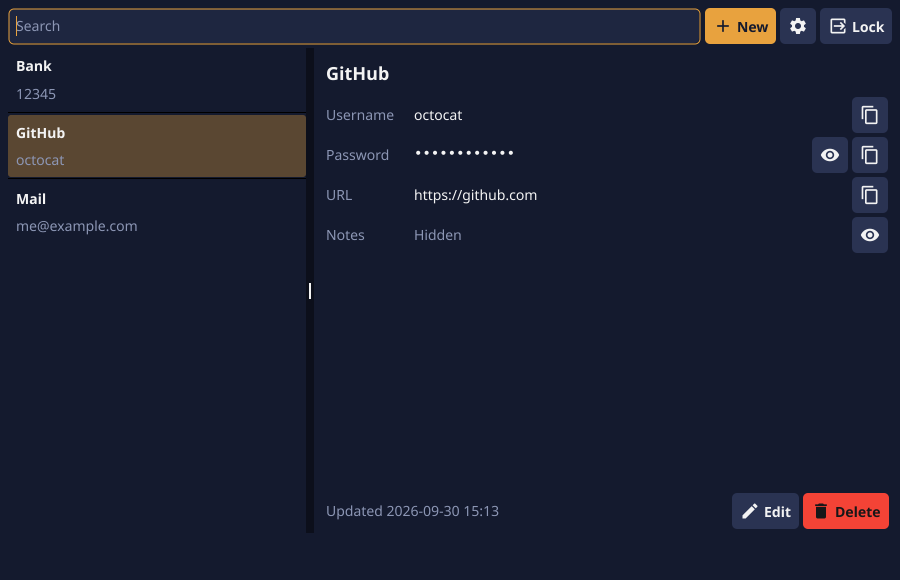

<p align="center">
  
</p>

<h1 align="center">Pangolin</h1>

<p align="center">
  A local-first password keeper that curls up around your secrets.
</p>

<p align="center">
  <a href="https://kaanbahasever.github.io/pangolin/"><b>Website</b></a> ·
  <a href="https://github.com/KaanBahaSever/pangolin/releases/latest"><b>Download</b></a> ·
  <a href="architecture.md"><b>Architecture</b></a>
</p>

<p align="center">
  <a href="https://github.com/KaanBahaSever/pangolin/actions/workflows/ci.yml"></a>
  <a href="https://github.com/KaanBahaSever/pangolin/releases/latest"></a>
  
  
  
  
  
  
  <a href="LICENSE"></a>
</p>

---

Pangolin keeps your passwords in an encrypted vault on your own computer.
There is no account, no server and no sync; the application never opens a
network connection. One master password unlocks the vault, and it is never
stored anywhere.

<p align="center">
  <picture>
    <source media="(prefers-color-scheme: light)" srcset="docs/screenshot-light.png">
    
  </picture>
</p>

> [!WARNING]
> Pangolin is new and has not had an independent security audit. It is built
> from standard, well-reviewed primitives, but treat it accordingly and keep a
> backup of anything you cannot afford to lose.

## Features

- **Encrypted at rest, twice.** The whole database is encrypted by SQLCipher,
  and every password and note is sealed again on its own.
- **One window.** Search as you type, select, copy. No launcher, no pop-up
  windows, no save button.
- **Locks itself** after a period of inactivity, and on demand.
- **Clipboard clears itself** a few seconds after you copy a password.
- **Password generator** with length and character-class options.
- **English and Turkish** interface, switchable at any time.
- **Light and dark** themes; follows the system by default.
- **Nothing to lose on a crash.** Every change is written immediately.

## Download

Get the latest version from the [website](https://kaanbahasever.github.io/pangolin/#download)
or the [releases page](https://github.com/KaanBahaSever/pangolin/releases/latest).

| Platform | Package | Install |
|---|---|---|
| Windows 10 / 11, 64-bit | `pangolin-windows-amd64.zip` | Unzip anywhere and run `Pangolin.exe` |
| macOS 11+, Apple Silicon and Intel | `pangolin-macos-universal.dmg` | Open it and drag Pangolin to Applications |
| Debian, Ubuntu, Mint | `pangolin-linux-amd64.deb` (or `-arm64`) | `sudo apt install ./pangolin-linux-amd64.deb` |
| Other Linux | `pangolin-linux-amd64.tar.gz` (or `-arm64`) | Unpack and run `./install.sh`; no root needed |

Every release comes with `SHA256SUMS.txt`.

The builds are not code-signed yet, so Windows SmartScreen and macOS
Gatekeeper warn the first time. On macOS, if Pangolin refuses to open, allow
it under System Settings → Privacy & Security → Open Anyway.

## Build from source

You need [Go](https://go.dev/dl/) 1.26 or newer and a C compiler, because
the GUI toolkit and SQLCipher are built with cgo.

| Platform | Prerequisites |
|---|---|
| Windows | GCC from [MSYS2](https://www.msys2.org/) (`pacman -S mingw-w64-ucrt-x86_64-gcc`) or another MinGW-w64 distribution, on your `PATH` |
| macOS | Xcode command line tools: `xcode-select --install` |
| Debian / Ubuntu | `sudo apt install gcc libgl1-mesa-dev xorg-dev` |
| Fedora | `sudo dnf install gcc libXcursor-devel libXrandr-devel mesa-libGL-devel libXi-devel libXinerama-devel libXxf86vm-devel` |

```bash
git clone https://github.com/KaanBahaSever/pangolin.git
cd pangolin
go run ./cmd/pangolin
```

The first build compiles SQLCipher and the graphics bindings and takes a few
minutes; later builds are fast.

To build a binary:

```bash
# macOS and Linux
go build -o bin/pangolin ./cmd/pangolin

# Windows (no console window)
go build -ldflags "-H=windowsgui" -o bin/pangolin.exe ./cmd/pangolin
```

To build the release package for the platform you are on (a `.zip` on
Windows, a universal `.dmg` on macOS, a `.deb` and `.tar.gz` on Linux):

```bash
bash packaging/build.sh 1.2.3
```

A release is published by pushing a version tag; GitHub Actions then tests
and packages every platform:

```bash
git tag v1.2.3 && git push origin v1.2.3
```

The Windows executable gets its icon from `cmd/pangolin/rsrc_windows_amd64.syso`,
which the Go linker includes automatically. After changing `assets/icon.ico`,
regenerate it with:

```bash
go run github.com/akavel/rsrc@v0.10.2 -ico assets/icon.ico -arch amd64 -o cmd/pangolin/rsrc_windows_amd64.syso
```

Run the tests:

```bash
go test ./...
```

### Where the vault lives

| Platform | Location |
|---|---|
| Windows | `%AppData%\Pangolin` |
| macOS | `~/Library/Application Support/Pangolin` |
| Linux | `~/.config/Pangolin` |

Set `PANGOLIN_HOME` to use another directory. To back up a vault, copy the
whole directory (`vault.header` and `vault.db`) while Pangolin is closed. Both
files are needed, and both are useless without the master password.

> [!IMPORTANT]
> There is no password recovery. If you forget the master password, the vault
> cannot be opened by anyone.

## Architecture

The full design, including the review of the plan it replaced, is in
[architecture.md](architecture.md). In short:

```
master password ──Argon2id──▶ key-encryption key
                                    │ unwraps
                                    ▼
                              master key (random)
                         ┌──────────┴──────────┐
                       HKDF                  HKDF
                         ▼                     ▼
                   database key            field key
                         │                     │
                     SQLCipher        XChaCha20-Poly1305
                  (whole database)   (each password, each note)
```

| Concern | Choice |
|---|---|
| Key derivation | Argon2id, 256 MiB, 4 passes, per-vault salt; parameters stored with the vault |
| Database | SQLCipher: AES-256 with a per-page HMAC-SHA-512, keyed with a raw 256-bit key |
| Secret fields | XChaCha20-Poly1305, bound to their entry and field so they cannot be swapped |
| Key storage | Random master key wrapped under the password-derived key; nothing else is persisted |
| Keys in memory | `memguard`: locked, guarded, wiped on lock |
| GUI | Fyne, a native toolkit with no web view |

```
cmd/pangolin/         entry point
assets/               logo
internal/crypto/      KDF, AEAD, key derivation
internal/vault/       key slot, database, entries
internal/generator/   password generator
internal/session/     idle auto-lock, clipboard guard
internal/i18n/        English and Turkish
internal/ui/          screens and theme
packaging/            release packaging for each platform
```

## Threat model

**Pangolin protects against**

- theft or copying of the device, the disk, the vault folder or a backup;
- offline guessing of the master password, as far as a memory-hard KDF can;
- tampering with the vault files, which is detected and refused;
- an unattended unlocked session, through auto-lock;
- a password left on the clipboard, through auto-clear;
- shoulder surfing, by masking passwords until you ask to see one.

**Pangolin does not protect against**

- malware or another person acting as you while the vault is unlocked;
- a compromised operating system or hardware;
- a weak master password;
- clipboard history or cloud clipboard sync keeping a copy of what you copied.

Some limits come from the platform and are stated plainly in
[architecture.md §7.4](architecture.md#74-residual-risks): text shown in the
interface and placed on the clipboard cannot be reliably wiped from memory in
a garbage-collected runtime.

## Security reports

Please do not open a public issue for a vulnerability. Use GitHub's
[private vulnerability reporting](https://github.com/KaanBahaSever/pangolin/security/advisories/new)
instead.

## Why a pangolin?

A pangolin's defence is to curl into a ball of overlapping armour and wait.
That is what this application does: when it locks, the keys are destroyed and
what is left is a sealed ball. In the logo the curled body is the padlock, the
tail is the shackle and the nose is the keyhole.

## License

[MIT](LICENSE)
